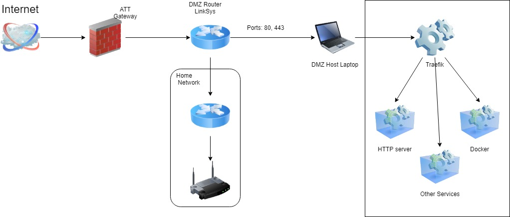

# Self-Hosting

## Introduction

I have this old T420 thinkpad (quad-core I7) which I decided to use to setup my own hosting environment. While reading on serverless deployments specially OpenFaaS I came across  _[Traefik](https://traefik.io/)_ and this was a perfect scenario to learn more. Whats a better way to learn something new than implementing it in some DIY project :wink:

## Network Setup

I already had a domain purchased with AWS _[apogee-dev.com](apogee-dev.com)_, so decided to use AWS _Route53_ as my DNS provider. So I came up with the following home network setup keeping in mind the security of the rest of home network devices.



* `DMZ Router (Linksys)` creates a private network which forwards HTTP, HTTPS traffic to the `DMZ Host Laptop`
* `DMZ Host Laptop` is configured to run docker. It is running _Traefik_ as the gateway & reverse proxy to several other services.
* `Traefik` uses [Let's Encrypt](https://letsencrypt.org/) to get valid certificates under _apogee-dev.com_ domain. For initial implementation the setup will host custom docker registry.

## Configure Traefik

_Traefik_ is hosted as docker image and created using `docker-compose` with following compose file.

```yaml
version: '3'

services:
  # The reverse proxy service (Traefik)
  reverse-proxy:
    image: traefik  # The official Traefik docker image
    restart: always
    command: --api --docker  # Enables the web UI and tells Traefik to listen to docker
    ports:
      - "80:80"      # The HTTP port
      - "443:443"
      - "8080:8080"  # The Web UI (enabled by --api)
    networks:
      - web
    volumes:
      - /var/run/docker.sock:/var/run/docker.sock  # So that Traefik can listen to the Docker events
      - /mnt/ssd/projects/traefik-local/traefik.toml:/traefik.toml
      - /mnt/ssd/projects/traefik-local/acme.json:/acme.json
    container_name: traefik

networks:
  web:
    external: true
```

Traefik is listening to docker event and configures itself based on the Docker labels assigned to each container on the Docker host. Traefik uses `acme.json` file to store the certificates generated using `Let's Encrypt`. The _Traefik_ configuration file is as follows:

```toml
debug = false

logLevel = "INFO"
defaultEntryPoints = ["https","http"]

[entryPoints]
  [entryPoints.http]
  address = ":80"
    [entryPoints.http.redirect]
    entryPoint = "https"
  [entryPoints.https]
  address = ":443"
  [entryPoints.https.tls]

[retry]

[docker]
endpoint = "unix:///var/run/docker.sock"
domain = "offsite.apogee-dev.com"
watch = true
exposedByDefault = false

[acme]
email = "**email**"
storage = "acme.json"
entryPoint = "https"
onHostRule = true
[acme.httpChallenge]
entryPoint = "http"
[[acme.domains]]
  main = "offsite.apogee-dev.com"
[[acme.domains]]
  main = "docker-registry.apogee-dev.com"
```

`Traefik.toml` configuration generates two sub-domain certificates `offsite.apogee-dev.com` and `docker-registry.apogee-dev.com`.

## Docker Registry

_Traefik_ directs the `docker-registry` traffic to Docker registry container. Docker registry image is hosted using the following `docker-compose` file:

```yaml
version: "3.3"

services:
  registry:
    image: registry:2
    restart: "always"
    expose:
      - "5000"
    volumes:
     - "/mnt/ssd/projects/docker-registry/storage:/var/lib/registry"
    networks:
      - web
    labels:
      - "traefik.docker.network=web"
      - "traefik.enable=true"
      - "traefik.domain=docker-registry.apogee-dev.com"
      - "traefik.frontend.rule=Host:docker-registry.apogee-dev.com"
      - "traefik.port=5000"
      - "traefik.protocol=http"
    container_name: "docker_registry"

networks:
  web:
    external: true
```

Docker registry image uses `traefik.domain` & `traefik.frontend.rule` labels to configure itself in _Traefik_ and to route all traffic with matching `Host` header to its container.

## Work To-Do

This shows a very basic configuration for hosting services behind a reverse-proxy. This opens lot many possibilities for further improvements.

* Setting authentication for the Docker registry
* Host OpenFaaS
* Add generic authentication delegation service for _Traefik_.

